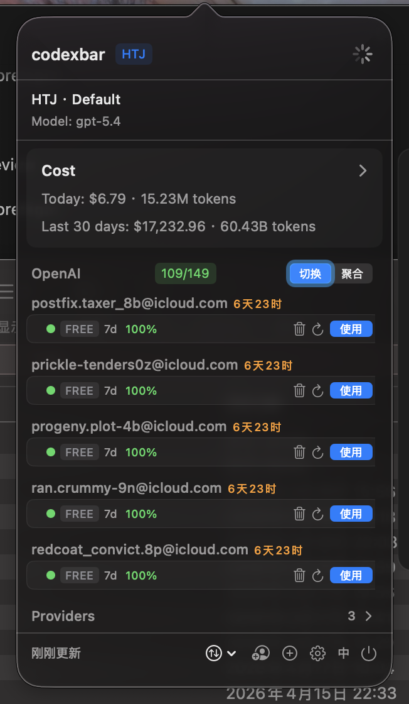
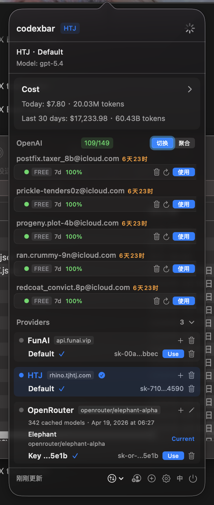
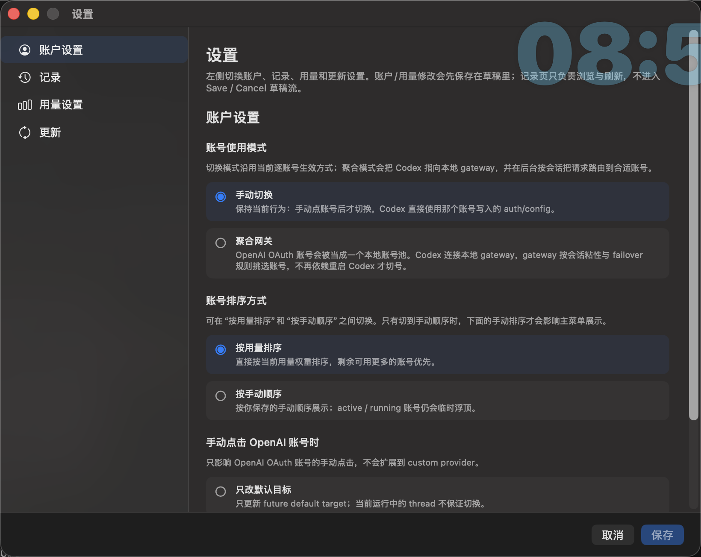

# codexbar

Keep Codex Desktop context and session history in one shared `~/.codex` pool while switching accounts or providers.

`codexbar` is a macOS menu bar utility for Codex Desktop users. It is not trying to replace Codex. It narrows in on the part of the workflow where account or provider switching tends to fragment context and session continuity.

> Switching account or provider should not mean splitting your original Codex session pool into multiple homes.

## At A Glance

- Keep one shared `~/.codex` instead of creating a separate `CODEX_HOME` per account
- Manage OpenAI OAuth, OpenAI-compatible providers, and multiple API keys from the menu bar
- Support both **manual switch** and **aggregate gateway** modes for OpenAI accounts
- Scan local sessions directly for usage, token, and cost estimates
- Make switching affect future sessions without breaking the existing history pool

## Problem It Solves

If you switch often between official OpenAI accounts, relay backends, or OpenAI-compatible providers, the common failure mode is always similar:

- configuration changes, but context feels disconnected
- session files still exist on disk, but history feels fragmented after switching
- manually editing config files is tedious and error-prone

`codexbar` is meant to make that switching workflow feel like one continuous Codex workspace instead of several loosely related homes.

## Screenshots

These screenshots reflect the current product UI used by the README. The descriptions focus on what each surface lets you do directly from the app.

### OpenAI Account View

The main menu surfaces the current mode, model, daily and 30-day cost summaries, account availability, and the timing signals that actually determine when an exhausted OpenAI account becomes usable again.

<p align="center">
  
</p>

### Provider Management View

The provider section expands inline, so you can manage multiple OpenAI-compatible backends, multiple API-key accounts per backend, and the active default target without leaving the menu bar workflow.

<p align="center">
  
</p>

### Settings Window

The settings window consolidates account mode, ordering rules, manual activation behavior, preferred Codex Desktop path, and update-related controls into one dedicated surface.

<p align="center">
  
</p>

## One Shared `~/.codex` Session Pool

Many multi-account workflows isolate each account by creating a separate `CODEX_HOME`. That gives strong separation, but also creates obvious tradeoffs:

- history gets split across multiple directories
- switching can feel like your previous context disappeared
- finding the right session becomes harder

`codexbar` takes the opposite approach:

- keep a single `~/.codex`
- preserve `~/.codex/sessions` and `~/.codex/archived_sessions` as one shared history pool
- write the active provider / account into `~/.codex/config.toml` and `~/.codex/auth.json`
- let switching affect only future requests and future sessions

That is the main value of the app: switching account or provider does not mean splitting the original Codex history pool.

## Features

- Multiple OpenAI OAuth accounts
- Multiple OpenAI-compatible providers
- Multiple API-key accounts under the same provider
- Fast switching from the menu bar
- Dual OpenAI account modes: **manual switch / aggregate gateway**
- OpenAI account CSV import / export
- OpenAI account ordering: quota-weighted or manual order
- Settings for manual activation behavior and preferred Codex.app path
- Local usage and cost estimates
- Runtime version detection from GitHub Releases plus a manual "Check for Updates" entry

Local usage and cost estimates are derived from:

- `~/.codex/sessions`
- `~/.codex/archived_sessions`

So you can inspect token usage and estimated cost directly from local session history.

The current UI also covers a few newer workflow details that the older README did not show clearly:

- OpenAI accounts can run in either **manual switch** mode or **aggregate gateway** mode
- OpenAI OAuth accounts can be imported from or exported to CSV
- Settings also let you choose whether OpenAI accounts are shown by quota-weighted ranking or your own manual order
- manual activation can either update config only or launch a fresh Codex instance while already-running instances stay open
- when launching a fresh instance, you can set a preferred local Codex.app path in Settings, and invalid paths fall back to automatic detection

## Version Checks and Updates

Fixed clients now scan the GitHub Releases list at runtime and choose the **first installable stable release**. The app still performs a non-blocking check on launch, and the menu bar UI also exposes a manual "Check for Updates" action.

The current boundary is intentionally narrow:

- the stable feed is still in **guided download / install** mode
- when a newer version exists, codexbar shows it in the menu/status UI so you can continue with the matching installer asset
- runtime checks skip `draft`, `prerelease`, and any release that does not ship installable `dmg` or `zip` assets
- the current build does **not** pretend that automatic app replacement and restart are already available
- `release-feed/stable.json` is now only a one-time compatibility bridge for `1.1.8 -> 1.1.9`; it is no longer the runtime source of truth for fixed clients
- if you already installed the **first 1.1.9 build**, a same-version reissue will not appear as an upgrade automatically; you must download the reissued build manually

See also:

- [docs/update-feed-rollout.md](./docs/update-feed-rollout.md)

## Who This Is For

`codexbar` is useful if:

- you use both official OpenAI accounts and third-party OpenAI-compatible providers
- you keep multiple API keys under the same provider
- you do not want to edit `config.toml` manually every time you switch
- you want to preserve one shared `~/.codex` history pool and resume experience

## Star History

<p align="center">
  <a href="https://star-history.com/#lizhelang/codexbar&Date">
    <picture>
      <source
        media="(prefers-color-scheme: dark)"
        srcset="https://api.star-history.com/svg?repos=lizhelang/codexbar&type=Date&theme=dark"
      />
      <source
        media="(prefers-color-scheme: light)"
        srcset="https://api.star-history.com/svg?repos=lizhelang/codexbar&type=Date"
      />
      
    </picture>
  </a>
</p>

## OpenAI Login Flow

OpenAI login currently uses a browser-based authorization flow with localhost callback capture plus a manual fallback. The entry point is the person-plus button in the bottom toolbar:

1. Click the login button
2. Finish authorization in the browser
3. When the browser reaches `http://localhost:1455/auth/callback?...`, codexbar captures the callback automatically
4. codexbar completes token exchange and imports the account

If automatic capture fails, you can still paste the full callback URL or the raw `code` back into the window manually.

## Cost Notes

The displayed values are **local usage estimates**, not official billing numbers.

Important caveats:

- token counts are the more stable metric
- dollar values are estimated from pricing tables
- for custom OpenAI-compatible providers, displayed cost may differ from actual upstream billing

If a third-party provider uses a different pricing model than OpenAI, the dollar amount shown in the app should be treated as an approximation only.

## Project Scope

The current version focuses on:

- multi-account management
- multi-provider switching
- a shared `~/.codex` session pool
- local usage and cost summaries

This repository does not bundle any private provider, API key, or personal account configuration. You add your own configuration locally.

## Requirements

- macOS 13+
- [Codex Desktop / CLI](https://github.com/openai/codex)
- Xcode 15+ if you want to build locally

## Build Locally

```sh
git clone https://github.com/lizhelang/codexbar.git
cd codexbar
open codexbar.xcodeproj
```

Then:

1. Select your signing team in Xcode
2. Build and run the `codexbar` target

## Acknowledgements

This project references and adapts ideas and parts of the implementation from these MIT-licensed projects:

- [xmasdong/codexbar](https://github.com/xmasdong/codexbar)
- [steipete/CodexBar](https://github.com/steipete/CodexBar)

See also:

- [THIRD_PARTY_NOTICES.md](./THIRD_PARTY_NOTICES.md)

## License

[MIT](./LICENSE)
