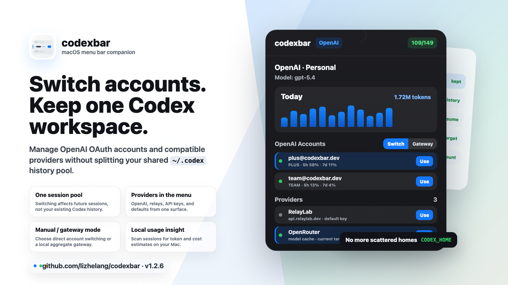

# codexbar

Keep Codex Desktop context and session history in one shared `~/.codex` pool while switching accounts or providers.

`codexbar` is a macOS menu bar utility for Codex Desktop users. It is not trying to replace Codex. It narrows in on the part of the workflow where account or provider switching tends to fragment context and session continuity.

> Switching account or provider should not mean splitting your original Codex session pool into multiple homes.

## At A Glance

- Keep one shared `~/.codex` instead of creating a separate `CODEX_HOME` per account
- Manage OpenAI OAuth, OpenAI-compatible providers, and multiple API keys from the menu bar
- Support both **manual switch** and **aggregate gateway** modes for OpenAI accounts
- Read local usage from Codex, Claude Code, OpenCode, and DeepSeek Harness; sync Cursor usage automatically, with CSV import available
- Choose a tool first, then switch between Today / This month / Total (with last 7 / 30 days available), and Tokens / Cost in the menu bar
- Make switching affect future sessions without breaking the existing history pool

## Problem It Solves

If you switch often between official OpenAI accounts, relay backends, or OpenAI-compatible providers, the common failure mode is always similar:

- configuration changes, but context feels disconnected
- session files still exist on disk, but history feels fragmented after switching
- manually editing config files is tedious and error-prone

`codexbar` is meant to make that switching workflow feel like one continuous Codex workspace instead of several loosely related homes.

## Product Overview

This poster-style overview focuses on the core workflow: use `codexbar` from the macOS menu bar to switch OpenAI accounts, compatible providers, and local gateway mode while keeping one shared `~/.codex` session pool.

<p align="center">
  
</p>

## One Shared `~/.codex` Session Pool

Many multi-account workflows isolate each account by creating a separate `CODEX_HOME`. That gives strong separation, but also creates obvious tradeoffs:

- history gets split across multiple directories
- switching can feel like your previous context disappeared
- finding the right session becomes harder

`codexbar` takes the opposite approach:

- keep a single `~/.codex`
- preserve `~/.codex/sessions` and `~/.codex/archived_sessions` as one shared history pool
- write the active provider / account into `~/.codex/config.toml` and `~/.codex/auth.json`
- let switching affect only future requests and future sessions

That is the main value of the app: switching account or provider does not mean splitting the original Codex history pool.

## Features

- Multiple OpenAI OAuth accounts
- Multiple OpenAI-compatible providers
- Multiple API-key accounts under the same provider
- Fast switching from the menu bar
- Dual OpenAI account modes: **manual switch / aggregate gateway**
- OpenAI account CSV import / export
- OpenAI account ordering: quota-weighted or manual order
- Settings for manual activation behavior and preferred Codex.app path
- Usage views for Codex and other AI tools
- Runtime version detection from GitHub Releases plus a manual "Check for Updates" entry

### Usage Sources and Views

The menu bar switches between tools, Today / This month / Total (with last 7 / 30 days available), and Tokens / Cost. "All tools" totals the sources that have been read. Each tool keeps its own usage records; switching a Codex account or provider does not attribute another tool's usage to Codex. The all-time total covers available history, while the detail chart shows the last 30 days.

| Tool | Usage source |
| --- | --- |
| Codex | Local `~/.codex/sessions` and `~/.codex/archived_sessions` |
| Claude Code | Local Claude Code session records |
| OpenCode | Local OpenCode database or legacy records |
| DeepSeek Harness | Local DSH session records |
| Cursor | Read the local Cursor sign-in state and sync from Cursor's usage endpoint; CSV import from the Usage page is also available |

The app scans Claude Code, OpenCode, and DeepSeek Harness locally in the background without changing their records. Cursor auto-sync covers the account currently signed in on the desktop. It reads the access token from Cursor's sign-in database in read-only mode and requests account usage directly from Cursor. The token is used for that request only; Codexbar does not write it to its cache or logs. The Cursor row shows one current account; switching accounts and syncing successfully replaces that row's snapshot, and multi-account history management is not yet available. Cursor's individual usage endpoint is unpublished and may change. If syncing fails, use the import button on the Cursor row to select a CSV exported from Cursor's Usage page. Importing again replaces the previous Cursor snapshot so overlapping exports are not added twice.

Codex history uses the local `~/.codexbar/cost-usage.sqlite` derived index. It resumes from changed JSONL bytes in bounded background passes, keeps the last available result during a scan, and does not modify the original sessions. **Codex local sessions** count tokens as `input + cached_input + output`; other tools use the usage fields reported in their own records. The cross-tool cache at `~/.codexbar/tool-usage-summary.json` stores daily usage aggregates, source status, and timestamps only; it does not store transcript content or login credentials.

The figures cover only the available local records, Cursor endpoint, or export. They are not live usage or official billing totals. If a source has no trustworthy cost, the Cost view shows the known portion and marks it incomplete; Tokens remain available separately.

The current UI also covers a few newer workflow details that the older README did not show clearly:

- OpenAI accounts can run in either **manual switch** mode or **aggregate gateway** mode
- OpenAI OAuth accounts can be imported from or exported to CSV
- Settings also let you choose whether OpenAI accounts are shown by quota-weighted ranking or your own manual order

## Version Checks and Updates

Fixed clients now scan the GitHub Releases list at runtime and choose the **first installable stable release**. The app still performs a non-blocking check on launch, and the menu bar UI also exposes a manual "Check for Updates" action.

The current boundary is intentionally narrow:

- the stable feed is still in **guided download / install** mode
- when a newer version exists, codexbar shows it in the menu/status UI so you can continue with the matching installer asset
- runtime checks skip `draft`, `prerelease`, and any release that does not ship installable `dmg` or `zip` assets
- the current build does **not** pretend that automatic app replacement and restart are already available
- `release-feed/stable.json` is now only a one-time compatibility bridge for `1.1.8 -> 1.1.9`; it is no longer the runtime source of truth for fixed clients
- if you already installed the **first 1.1.9 build**, a same-version reissue will not appear as an upgrade automatically; you must download the reissued build manually

See also:

- [docs/update-feed-rollout.md](./docs/update-feed-rollout.md)

## Who This Is For

`codexbar` is useful if:

- you use both official OpenAI accounts and third-party OpenAI-compatible providers
- you keep multiple API keys under the same provider
- you do not want to edit `config.toml` manually every time you switch
- you want to preserve one shared `~/.codex` history pool and resume experience

## Star History

<p align="center">
  <a href="https://star-history.com/#lizhelang/codexbar&Date">
    <picture>
      <source
        media="(prefers-color-scheme: dark)"
        srcset="https://api.star-history.com/svg?repos=lizhelang/codexbar&type=Date&theme=dark"
      />
      <source
        media="(prefers-color-scheme: light)"
        srcset="https://api.star-history.com/svg?repos=lizhelang/codexbar&type=Date"
      />
      
    </picture>
  </a>
</p>

## OpenAI Login Flow

OpenAI login currently uses a browser-based authorization flow with localhost callback capture plus a manual fallback. The entry point is the person-plus button in the bottom toolbar:

1. Click the login button
2. Finish authorization in the browser
3. When the browser reaches `http://localhost:1455/auth/callback?...`, codexbar captures the callback automatically
4. codexbar completes token exchange and imports the account

If automatic capture fails, you can still paste the full callback URL or the raw `code` back into the window manually.

## Cost Notes

The displayed values are **views of local records and imported usage**, not official billing numbers.

Important caveats:

- token counts are the more stable metric
- Codex dollar values are estimated from model pricing tables; other tools use costs reported in their local records, Cursor's usage endpoint, or its export when available
- local history is indexed in `~/.codexbar/cost-usage.sqlite`; append-only session updates resume from persisted byte offsets instead of rescanning complete files
- large first-time history imports catch up in bounded background passes while the app keeps the last known good snapshot and shows the real scan state
- for custom OpenAI-compatible providers, displayed cost may differ from actual upstream billing

If a third-party provider uses a different pricing model than OpenAI, the dollar amount shown in the app should be treated as an approximation only.

## Project Scope

The current version focuses on:

- multi-account management
- multi-provider switching
- a shared `~/.codex` session pool
- local usage and cost summaries

This repository does not bundle any private provider, API key, or personal account configuration. You add your own configuration locally.

## Requirements

- macOS 13+
- [Codex Desktop / CLI](https://github.com/openai/codex)
- Xcode 15+ if you want to build locally

## Build Locally

```sh
git clone https://github.com/lizhelang/codexbar.git
cd codexbar
open codexbar.xcodeproj
```

Then:

1. Select your signing team in Xcode
2. Build and run the `codexbar` target

## Acknowledgements

This project references ideas, implementation, and visual design from these MIT-licensed projects:

- [xmasdong/codexbar](https://github.com/xmasdong/codexbar)
- [steipete/CodexBar](https://github.com/steipete/CodexBar)
- [Javis603/token-monitor](https://github.com/Javis603/token-monitor) (visual hierarchy reference for the menu and settings)

See also:

- [THIRD_PARTY_NOTICES.md](./THIRD_PARTY_NOTICES.md)

## License

[MIT](./LICENSE)
