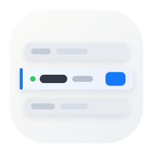

<p align="center">
  
</p>

<h1 align="center">codexbar</h1>

<p align="center">
  <a href="./LICENSE"></a>
  <a href="https://github.com/lizhelang/codexbar/releases"></a>
  
  
</p>

<p align="center">
  让 Codex Desktop 在多账号 / 多 provider 切换时，继续共用同一个 <code>~/.codex</code> 历史池。
</p>

<p align="center">
  <a href="./README.en.md">English</a> | 简体中文
</p>

<p align="center">
  
</p>

`codexbar` 是一个面向 macOS 的菜单栏工具。它不重做 Codex，而是把“切账号、切 provider 时最容易把上下文和历史切散”的那一段工作收回来。

> 切账号 / 切 provider，不等于把 Codex 原本的 session 池拆成几份。

## 一眼看懂

- 只保留一个 `~/.codex`，不为每个账号单独建一套 `CODEX_HOME`
- 在菜单栏里管理 OpenAI OAuth、多 OpenAI 兼容 provider、同 provider 多组 API key
- 支持 OpenAI 账号的 **手动切换 / 聚合网关** 双模式
- 直接扫描本地 session，展示 usage、token 和成本估算
- 切换只影响后续新会话，不会把已有历史 session 从共享池子里“切没了”

## 它主要解决什么问题

如果你经常在不同 OpenAI 账号、不同中转站、或者不同 OpenAI 兼容 provider 之间来回切，通常会遇到几件事：

- 配置切过去了，但上下文像是断了
- 历史 session 还在磁盘里，却因为切账号 / 切 provider 变得不连贯
- 反复手改配置文件很烦，恢复现场也麻烦

`codexbar` 解决的不是“再造一个 Codex”，而是把这条切换链路变成一个更稳、更快、更少丢上下文的菜单栏工作流。

## 产品概览

上面的海报式概览把当前版本最重要的工作流放在一张图里：`codexbar` 是 macOS 菜单栏里的 Codex Desktop companion，用来在 OpenAI 账号、兼容 provider 和本地 gateway 工作流之间切换，同时继续保留同一个 `~/.codex` 会话池。

## 不拆 `~/.codex`，保留同一个会话池

很多“多账号切换”方案会直接给每个账号单独建一套 `CODEX_HOME`。这样做隔离很强，但代价也很明显：

- 历史被分散到多份目录
- 切换之后很容易觉得“上下文没了”
- 需要在不同账号环境之间来回找 session

`codexbar` 选的是另一条路：

- 仍然只保留一个 `~/.codex`
- 保留 `~/.codex/sessions` 和 `~/.codex/archived_sessions` 这一套共享历史池
- 当前激活的 provider / account 会同步到 `~/.codex/config.toml` 和 `~/.codex/auth.json`
- 切换只影响之后发起的新请求和新会话

这也是它最核心的价值：切账号 / 切 provider，不等于把 Codex 原本的历史池拆掉。

## 现在支持什么

- 多 OpenAI OAuth 账号管理
- 多 OpenAI 兼容 provider 管理
- 同一 provider 下挂多组 API key
- 菜单栏里快速切换 provider / account
- OpenAI 账号的 **手动切换 / 聚合网关** 双模式
- OpenAI 账号 CSV 导入 / 导出
- OpenAI 账号支持按用量排序 / 按手动顺序排序
- 设置页里配置手动激活策略与 Codex.app 路径
- 账号行右键「新开实例」：隔离 Chromium profile / TMPDIR，会话与写锁仍共享 `~/.codex`
- 本地 usage / 成本统计
- GitHub Releases 运行时版本检测与手动“检查更新”

### 第三方服务与协议兼容性

内置快捷预设仅保留已确认提供 Responses 接口的 DeepSeek、智谱 GLM、OpenRouter 和
Requesty，新建预设统一使用 Responses。其他服务可在
**Custom** 中填写地址、密钥、模型和协议（默认 Responses）。移除快捷预设不会删除
用户已经保存的服务和账号；预设仅用于简化填写，不代表所有功能均已通过实机验证。

已保存的 Chat Completions 配置不会被自动改写。预设更新仅影响新建服务；已有配置仍按
原协议工作。首次识别旧 Chat 服务时会提示检查兼容性；在 Providers 中点击“查看兼容性”，
可预览官方地址和模型的变化，确认后原地切换到 Responses，保留全部账号与密钥。
未知中转地址不会被自动替换，需先核对服务商能力。

| 预设 | Responses 基址 | 默认模型 | 官方文档 |
| --- | --- | --- | --- |
| DeepSeek | `https://api.deepseek.com` | `deepseek-flash` | [Responses 指南](https://api-docs.deepseek.com/guides/responses_api/) |
| 智谱 GLM | `https://open.bigmodel.cn/api/v1` | `glm-5.3` | [Responses 兼容指南](https://docs.bigmodel.cn/cn/guide/develop/responses/introduction) |
| OpenRouter | `https://openrouter.ai/api/v1` | 按账号目录选择 | [Responses API](https://openrouter.ai/docs/api/api-reference/responses/create-responses) |
| Requesty | `https://router.requesty.ai/v1` | `openai-responses/gpt-5` | [Responses API](https://docs.requesty.ai/api-reference/endpoint/responses-create) |

以上于 2026-09-28 核对官方文档。Responses 接口可用不代表功能与 OpenAI 完全一致；
例如 DeepSeek 对托管工具和 custom 工具有明确限制，Requesty 的 OpenAI 原生 Responses
模型使用 `openai-responses/` 前缀。DeepSeek 官方 Responses 的 custom 工具目前仅支持
`apply_patch`；`exec` 等其他名称会返回 400，联网搜索等部分内置工具也不受支持。
新建 DeepSeek 配置或添加账号时，会在保存前说明这项限制；可继续保存或返回修改。
OpenRouter 继续使用现有的 Responses 转发服务，
不经过 Chat Completions 转换网关。

第三方服务使用 Codex 官方的独立 `model_providers` 配置：每个服务有自己的
`codexbar.<服务 ID>`、API 地址和认证字段。切换时同时选择服务与模型；普通第三方
切换不会把 API Key 写入 `auth.json`，也不会覆盖现有的 OpenAI 登录备份。
如果明确配置了固定 OAuth 登录身份，仍按该身份保留原有登录流程。

- **Responses API**：直接连接服务商提供的 Responses 接口。
- **Chat Completions**：通过本机转换网关连接。保存成功后会提示协议兼容性差异，
  建议优先选择原生 Responses 接口。工具调用、流式输出和高级功能的可用性仍取决于
  服务商和模型；未支持的工具类型会明确报错。
- 转换网关支持普通 function 和 custom 工具的调用/结果转换。custom 的 grammar
  要求会作为说明传递给上游，Chat Completions 无法提供相同的语法约束保证。
  普通回复中展示的命令或 `<tool_call>` 文字不会被自动当成工具执行。
- 当前转换网关不支持 `namespace` 和托管式 `web_search` 工具。如果 Codex 默认携带
  这些工具，整个请求会明确报错，即使本轮只打算执行普通命令。关闭多代理和联网搜索
  后的基础工具往返已通过隔离 CLI 验证；这不代表默认配置或第三方真实模型已全面兼容。

桌面应用不依赖终端环境变量导出密钥，因此使用官方支持的 provider 专属
`experimental_bearer_token` 字段；生成的 `config.toml` 权限为仅当前用户可读写
（`0600`），其中包含敏感认证信息，分享配置前需要脱敏。删除服务或更换凭据时，
会同步更新受管配置；手工维护的其他 provider、profile、MCP 配置和
`model_catalog_json` 模型目录引用会保留。

切回 OpenAI 时会恢复 OpenAI 的请求目标和对应认证。已有会话可能继续使用此前的
配置；切换服务后建议新开会话。第三方协议兼容不代表所有 Codex 功能均受支持。

本地 usage / 成本统计来自对下面目录的扫描：

- `~/.codex/sessions`
- `~/.codex/archived_sessions`

因此你能直接在本地看到 token 用量和成本估算，而不需要手动翻 session 文件。

成本历史会写入本机 `~/.codexbar/cost-usage.sqlite` 派生索引。应用只读取新增或变化的
JSONL 字节，并以后台分片方式追赶大型历史；扫描期间继续显示上一次可用结果，同时在
Cost 卡片里展示真实进度、陈旧状态或失败原因。这个索引可安全重建，不会修改原始 session。

当前 token 统计只认本地 session，口径固定为：

- `input + cached_input + output`

不会额外拉取或聚合任何远端 usage。

另外，当前界面还补上了几类更贴近真实日常切换的能力：

- OpenAI 账号支持 **手动切换 / 聚合网关** 两种使用模式
- 支持导入 / 导出 OpenAI 账号数据文件，与 Sub2API 格式互通，方便迁移和批量整理
- 支持在设置页里切换 OpenAI 账号排序方式：按当前用量排序，或按手动顺序展示
- 支持设置手动激活行为：只改配置，或直接拉起新的 Codex 实例；已在运行的实例会继续保留
- 当选择“拉起新实例”时，可以在设置页指定 Codex.app 的本地路径；路径失效时会自动回退系统探测

## 版本检测与更新

修复后的客户端运行时会直接扫描 GitHub Releases 列表，选择**第一个可安装的正式稳定版本**；应用启动时会做非阻塞检查，菜单栏里也可以手动触发“检查更新”。

但要特别说明当前边界：

- 当前稳定版本默认仍是 **guided download / install**
- 这表示发现新版本后，codexbar 会在菜单和更新状态里显示可用版本，由你继续打开匹配安装包下载链接
- 运行时会跳过 `draft`、`prerelease`、以及不带 `dmg/zip` 资产的 release
- 当前版本**不会假装**已经支持自动替换旧 app 并自动重启
- `release-feed/stable.json` 只保留这一次 `1.1.8 -> 1.1.9` 的兼容桥接，不再是修复后客户端的运行时真相源
- 如果你已经安装了**首发 1.1.9**，同版本重发不会自动把它识别为可升级；需要手工下载重发 build

更新 bridge / rollout 约定见：

- [docs/update-feed-rollout.md](./docs/update-feed-rollout.md)

## 适合哪些用户

如果你符合下面这些情况，`codexbar` 会比较有用：

- 你会同时使用 OpenAI 官方账号和第三方 OpenAI 兼容 provider
- 你同一个 provider 下会维护多组 API key
- 你不想每次切换都手改 `config.toml`
- 你希望保留同一个 `~/.codex` 的历史池和 resume 体验

## Star 历史

<p align="center">
  <a href="https://star-history.com/#lizhelang/codexbar&Date">
    <picture>
      <source
        media="(prefers-color-scheme: dark)"
        srcset="https://api.star-history.com/svg?repos=lizhelang/codexbar&type=Date&theme=dark"
      />
      <source
        media="(prefers-color-scheme: light)"
        srcset="https://api.star-history.com/svg?repos=lizhelang/codexbar&type=Date"
      />
      
    </picture>
  </a>
</p>

## OpenAI 登录方式

当前 OpenAI 登录采用“浏览器授权 + localhost 回调捕获，必要时可手工粘贴回调”的方式。入口在菜单底部工具栏的人像加号按钮：

1. 点击登录按钮
2. 在浏览器里完成授权
3. 当浏览器跳到 `http://localhost:1455/auth/callback?...` 时，codexbar 会自动捕获回调
4. codexbar 直接完成 token 交换并导入账号

如果自动捕获失败，仍然可以把完整回调 URL 或单独的 `code` 手工粘贴回窗口。

## 成本与账单说明

这里展示的是**本地 usage estimate**，不是官方账单页面的精确账单。

需要特别说明：

- token 数量更适合作为稳定指标
- 金额是基于模型价格表的估算
- 设置页会自动列出本地 session 中出现过的历史模型，你可以直接为这些模型设置 input / cached input / output 单价
- 未配置价格的模型默认按 `0` 成本处理，但 token 汇总仍会正常显示
- 首次建立大型历史索引时会在后台逐步追赶；未知或扫描中状态不会被当作真实 `0` 展示
- 对自定义 OpenAI 兼容 provider，显示的金额不一定等于真实供应商扣费

如果某个第三方 provider 的价格策略和 OpenAI 官方定价不同，那 README 和界面里显示的美元金额都只能视为近似估算，不应直接当作实际账单。

## 项目边界

当前版本重点是：

- 多账号管理
- 多 provider 切换
- 共享 `~/.codex` 会话池
- 本地 usage / 成本统计

它不会内置任何私有 provider、私有 API key、私有账号配置。你需要在自己的环境里自行添加这些内容。

## 运行环境

- macOS 13+
- [Codex Desktop / CLI](https://github.com/openai/codex)
- Xcode 15+（如果你要本地编译）

## 本地构建

```sh
git clone https://github.com/lizhelang/codexbar.git
cd codexbar
open codexbar.xcodeproj
```

然后：

1. 在 Xcode 里选择自己的签名团队
2. 构建并运行 `codexbar` target

## 致谢

这个项目参考并改造了下面两个 MIT 许可证项目中的思路与部分实现：

- [xmasdong/codexbar](https://github.com/xmasdong/codexbar)
- [steipete/CodexBar](https://github.com/steipete/CodexBar)

详细说明见：

- [THIRD_PARTY_NOTICES.md](THIRD_PARTY_NOTICES.md)

## License

[MIT](LICENSE)
