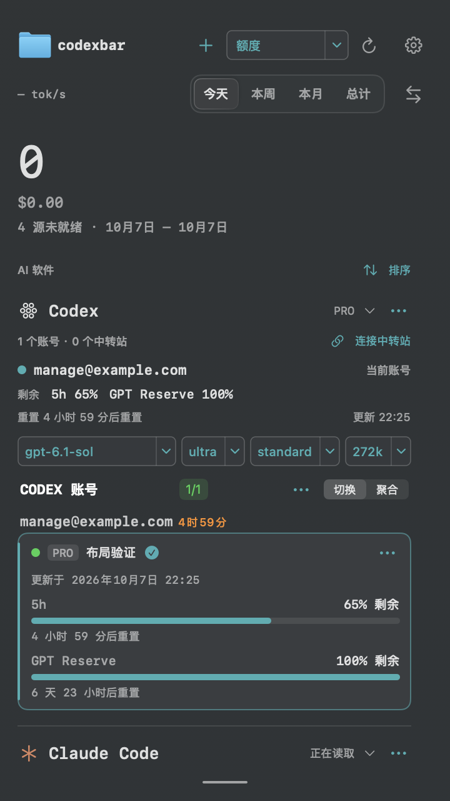
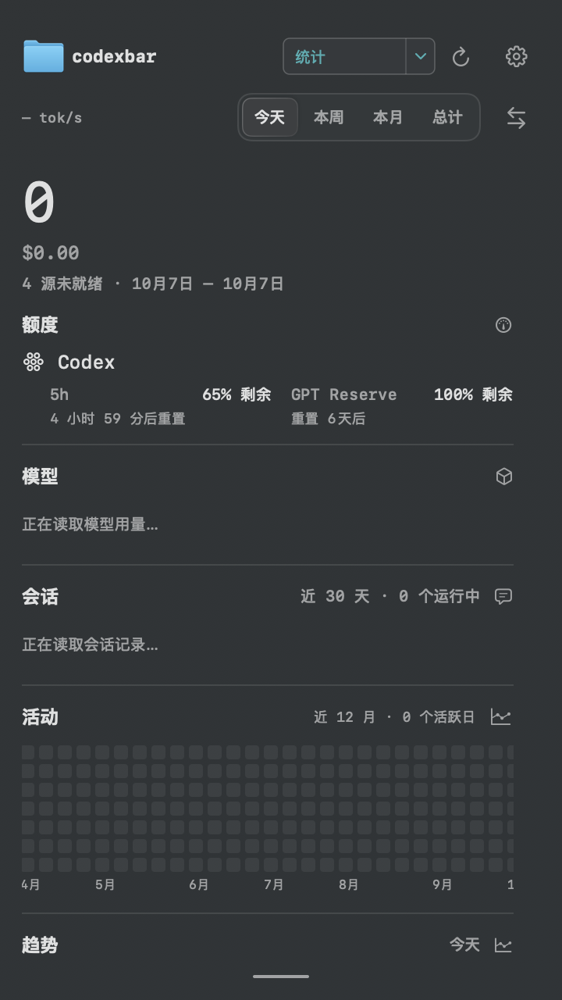
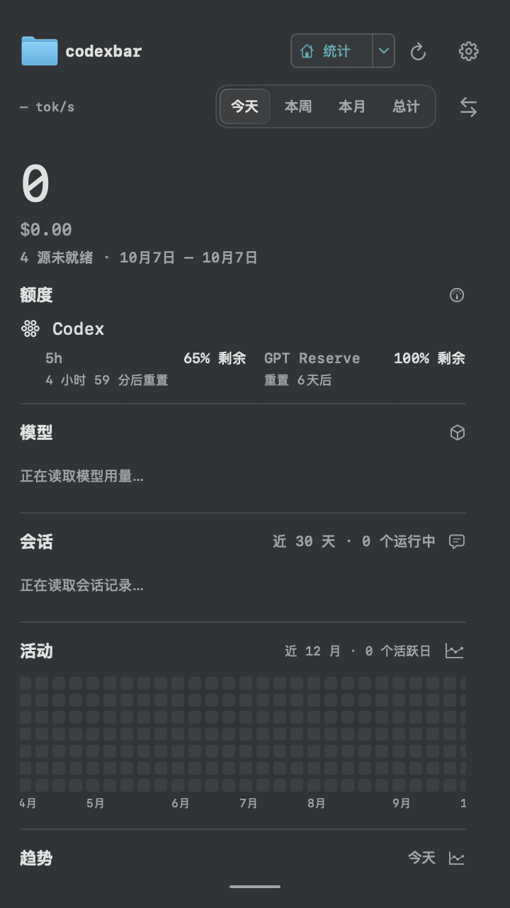

# 统一页面下拉导航验证

日期：2026-10-07（Australia/Sydney）。本地安装：`2.0.0 (55)`，路径 `/Applications/codexbar.app`。

## 界面结果

- 顶部单一下拉框替代“管理 / 看板”模式按钮与底部八页导航。
- 首次使用新导航时默认“额度”，直接显示原管理页；原看板独立额度内容删除。原主页更名“统计”，其他工具、模型、项目、会话、设备、趋势页面保留。
- 使用新的 `codexbar.menu.page` 保存选择；旧模式/看板页值不影响首次进入。下次创建菜单时恢复新导航选择。
- 保留页面原始 ID、自定义顺序与统计模块设置；额度和统计始终可见，隐藏当前其他页时退回额度。
- 所有页面共用相同滚动视口；底部导航释放 50pt，保留拖拽高度手柄。账号、软件展开/折叠、排序、路由控件与查看用量入口保留。

## 验证证据

- Release 构建通过，通用架构 `arm64 x86_64`；本地 ad-hoc 签名校验通过。
- 定向 XCTest 首轮运行 69 项：68 项通过、1 项失败。SettingsOffscreenLayoutTests 的 11 项全部通过，其中包含中英文 360pt 布局、八页原生菜单 action 在同一 host 内切换、选择持久化、首次默认额度和旧偏好兼容。
- ApplicationPreferencesTests、MenuBarPopoverSizingTests、MenuMonitorDisplayStateTests、MenuMonitorPresentationTests、RouteSelectionMenuTests 与菜单初始焦点检查通过；管理卡本页展开/重排及四个路由控件回归通过。
- 唯一失败为既有 `ManagedToolAccountIntegrationTests.testNativeAccountPanelsShowRealConnectionsAndProviderSpecificAddControls`：315pt Cursor 账号面板截图中 `Cursor Fixture A` 可见，但 Vision OCR 漏识别。该测试直接渲染 ManagedToolAccountsView，未经过新导航。单独复跑仍失败，保留记录，不修改断言。该文件本次只修改另一测试的 MenuBarView initializer。
- 仓库已有 `AutoRoutingCoordinatorTests.swift:131` 引用了不存在的 `TokenStoreError.invalidCodexAppPath`，因此本次构建测试时用 `EXCLUDED_SOURCE_FILE_NAMES=AutoRoutingCoordinatorTests.swift` 临时排除，未修改该文件，也未声称全量测试通过。
- 已安装应用 Info.plist 确认为 `2.0.0 (55)`，安装后进程运行。原生 CUA 读取持续超时，因此没有取得已安装应用的实时截图/交互证据；下面图片均为隔离测试窗口渲染，使用虚构账号和空用量数据。

英文证据：`2026-10-07-page-navigation/limits-en.png`、`statistics-en.png`。

## 构建与安装清理

- 已注销并删除本次 Debug/Release 构建副本、临时 DerivedData、回滚副本与隔离测试目录。保留运行日志和 xcresult 供审查。
- Launch Services 最终只登记 `/Applications/codexbar.app`，版本为 `55`，架构为 `x86_64 arm64`；安装后再次通过严格签名校验。
- Spotlight 最终查询持续无输出并超时，已终止该查询，未确认索引结果；可见安装入口以 Launch Services 的唯一登记结果核对。
- 安装后应用进程仍运行；用户既有未提交修改未还原，本次没有提交或推送。

## 运行记录

临时运行目录：`/private/tmp/codexbar-navigation-20261007.mrCcqB`，包含 `build.log`、`universal-build.log`、`tests.log`、`tests.xcresult`、`ocr-retry.log` 和 `ocr-retry.xcresult`。测试隔离使用 CODEXBAR_HOME，不读取或写入用户认证文件。测试排除配置仅在本次命令中生效。

## 后续：恢复图标并收窄选择框（2.0.0 build 56）

- 当前页按钮及八个菜单项均恢复各页原有 SF Symbols；统计沿用原主页的 house 标识。
- 中文按钮宽度由 98pt 改为 74pt；英文由 112pt 改为 104pt。使用紧凑内边距，按钮向刷新操作靠齐，时间范围行保持原布局。
- RouteSelectionMenuTests 的 14 项与 SettingsOffscreenLayoutTests 的 11 项全部通过（共 25 项，0 失败），包括各页图标、图文所需宽度、中文/英文尺寸及八页切换。此次未重跑与改动无关的账号面板 OCR 测试。
- Release 通用架构构建与严格 ad-hoc 签名校验通过，已替换本机 `/Applications/codexbar.app` 为 `2.0.0 (56)`。
- 本次 Debug/Release 副本、DerivedData、回滚副本和隔离测试目录已清理；Launch Services 最终仅登记目标安装副本。Spotlight 查询超时，使用 Launch Services 核对。
- 本轮运行证据保存在 `/private/tmp/codexbar-navigation-icons-20261007.nGsihC` 的 `build.log`、`tests.log` 与 `tests.xcresult`。继续使用前述独立测试环境与旧测试文件临时排除参数，没有提交或推送。
- 下图为隔离测试数据的离屏布局证据，未声称已完成实时界面交互验证。

英文预览：`2026-10-07-page-navigation/icons-statistics-en.png`。

## 后续：未选中图标与旧顺序迁移（2.0.0 build 57）

- 用户实际截图证明 build 56 的展开菜单没有显示未选中图标。上一轮仅证明 `NSMenuItem.image` 已赋值，不能据此判定图标实显。
- 本机 macOS 27.2、对应 AppKit SDK NSMenuItem.h 明确说明普通 `image` 在 macOS 27 默认可能隐藏。改用同一状态列：`showsStateColumn=true`，`offStateImage` 显示页面图标，选中状态沿用默认 `onStateImage` 系统勾；普通 `image` 保持为空。
- 读取用户当前偏好确认保存的是旧完整默认顺序 `home, limits, tools, models, projects, sessions, devices, trends`。只迁移该默认顺序为 `limits, home, ...`，真正自定义顺序与其他偏好继续保留。
- 首次无新导航选择时默认额度；已保存统计时继续显示统计。未改选择键、未清除用户已选页面。菜单首两项顺序和页面选择记忆是不同设置。
- 46 项定向回归全部通过：ApplicationPreferencesTests 21 项、RouteSelectionMenuTests 14 项、SettingsOffscreenLayoutTests 11 项。覆盖旧默认排序迁移、保存统计后的重建恢复、八页状态列图标及勾选状态。
- 这些测试检查原生菜单对象和离屏主面板；不生成真实系统 NSMenu 窗口的截图。CUA 可读取普通应用，但读取 Codexbar 浮层持续超时；全局快捷键路径也未获得浮层读取结果，因此本轮未声称真实菜单已截图验收。
- Release 通用架构构建、严格签名校验通过，本机已安装 `2.0.0 (57)` 且进程运行。已删除本次构建 .app、DerivedData、回滚副本和隔离目录；Launch Services 最终只登记 `/Applications/codexbar.app`。
- 运行证据保存在 `/private/tmp/codexbar-navigation-state-icons-20261007.36A8Cv` 的 `build.log`、`tests.log`、`tests.xcresult`。继续临时排除前述旧 AutoRoutingCoordinatorTests 编译问题；没有提交或推送。
